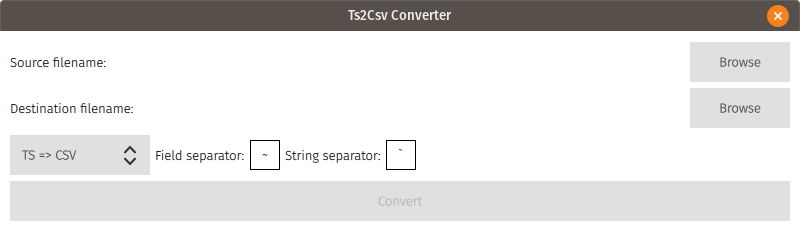

 [](https://opensource.org/licenses/MIT)

[](https://travis-ci.org/guerinoni/qt-ts-csv)

[](https://www.codacy.com/manual/guerinoni/qt-ts-csv?utm_source=github.com&amp;utm_medium=referral&amp;utm_content=guerinoni/qt-ts-csv&amp;utm_campaign=Badge_Grade)

# qTsConverter
This tool was born to convert `.ts` file of Qt translation in other format more editable using an office suite.
Now it supports `.ts` -> `.csv/.xlsx` and vice versa. You can also do conversion between `.csv` and `.xlsx` keeping in mind the use of header tags used to retrieve the right information of translation.

## Build
```
> mkdir build
> cd build
> cmake .. -DCMAKE_PREFIX_PATH=/opt/qt512/
> make
```

## Contributing
[guidelines](./doc/CONTRIBUTING.md)

## Usage

### To generate output.csv  
  

